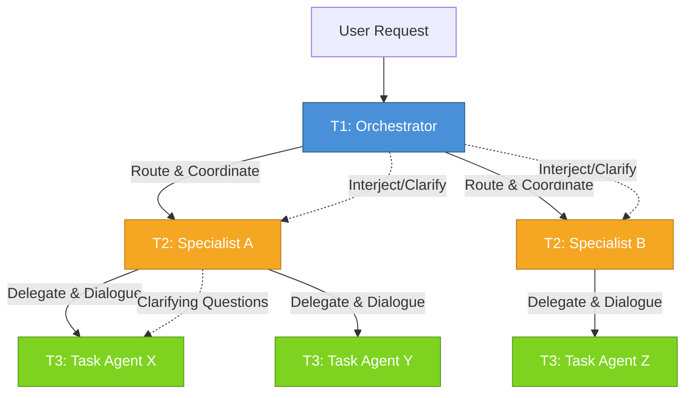
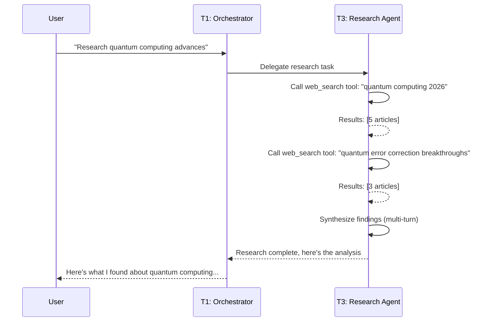
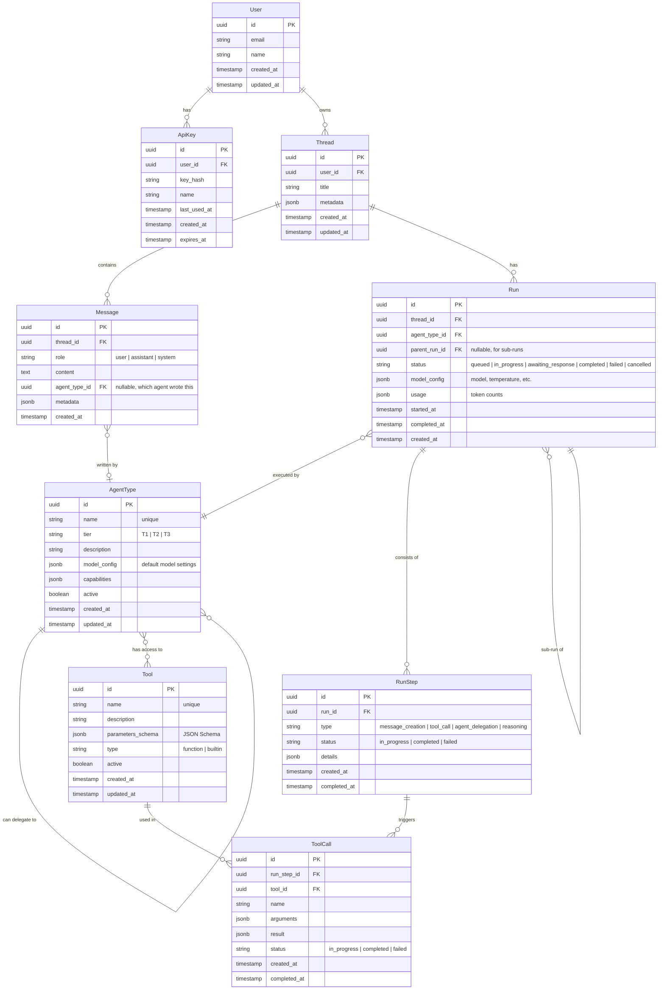
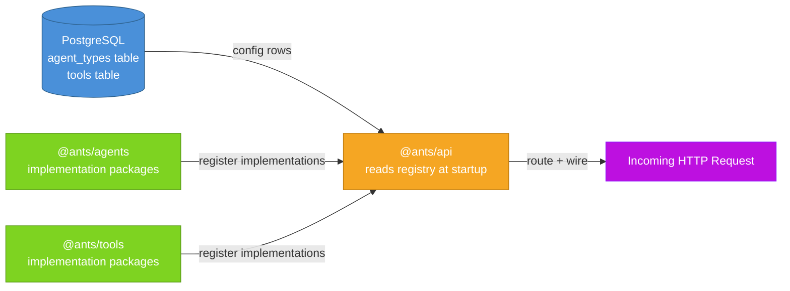
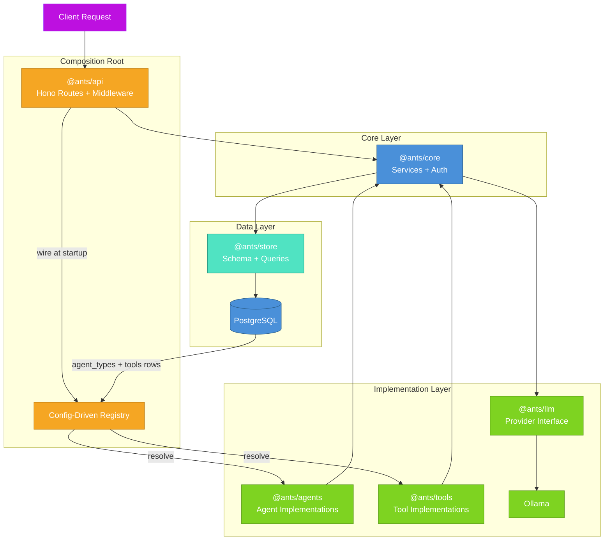
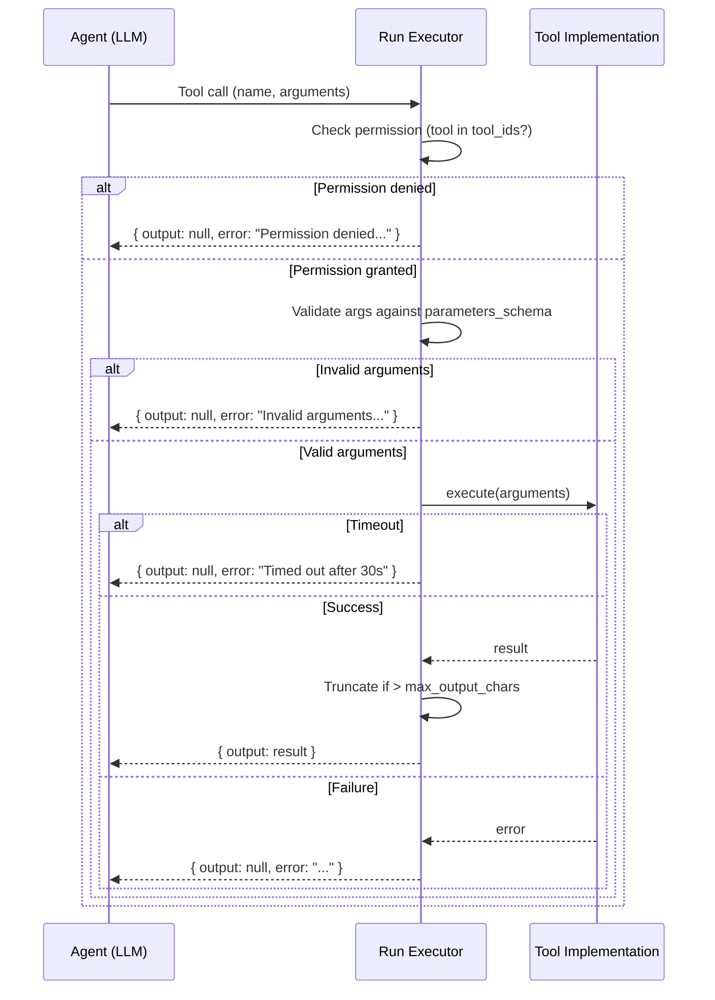
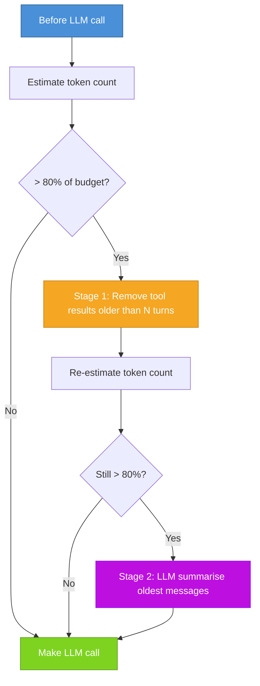

# ANTS Architecture Document

> **Status**: Canonical Reference — All development decisions must align with this document.
> **Last Updated**: 2026-06-10
> **Version**: 1.1-draft

---

## Table of Contents

1. [Project Overview](#1-project-overview)
2. [Tech Stack](#2-tech-stack)
3. [Three-Tier Conversational Hub-and-Spoke Agent Model](#3-three-tier-conversational-hub-and-spoke-agent-model)
4. [Data Model](#4-data-model)
5. [API Design Principles](#5-api-design-principles)
6. [Concurrency, Queueing, and Resource Management](#6-concurrency-queueing-and-resource-management)
7. [V1 Scope](#7-v1-scope)
8. [Future Extensions](#8-future-extensions)
9. [Project Structure](#9-project-structure)
10. [Tool Execution Model](#10-tool-execution-model)
11. [Context Compaction](#11-context-compaction)
12. [Error Handling](#12-error-handling)
10. [Tool Execution Model](#10-tool-execution-model)
11. [Context Compaction](#11-context-compaction)
12. [Error Handling](#12-error-handling)
10. [Tool Execution Model](#10-tool-execution-model)
11. [Context Compaction](#11-context-compaction)
12. [Error Handling](#12-error-handling)

---

## 1. Project Overview

**ANTS** (Autonomous Networked Task System) is a multi-agent orchestration and project management system designed to serve as the core runtime for **ANT**, a highly private, offline-first AI assistant being collaboratively built with Johnathan.

### Core Principles

- **API-First, No UI**: ANTS is a pure API system. There is no web interface, no dashboard, no frontend. All interaction is through a well-defined OpenAPI 3.1 specification. Consumers (CLI tools, future UIs, integrations) interact solely through the API.
- **Privacy-First, Offline-First**: Nothing leaves the machine. All inference runs locally. No cloud API calls, no telemetry, no data exfiltration. The system is designed to run entirely on local hardware, accepting quality trade-offs to maintain absolute privacy.
- **OpenAI-Inspired, Not Compatible**: The API takes inspiration from the OpenAI Assistants API for familiarity, but makes its own design decisions where they serve the project better. We do not guarantee drop-in compatibility.
- **Conversational Agents**: Agents converse — they engage in multi-turn dialogue, not fire-and-forget delegation. This is a foundational design choice that shapes the entire architecture.
- **Extensible from Day One**: Agent registries, tool registries, and the provider abstraction layer are present from v1, enabling future extension without architectural overhaul.


---

## 2. Tech Stack

Every technology choice is intentional and justified against alternatives.

| Layer | Choice | Rationale |
|-------|--------|-----------|
| **Runtime** | Bun | Fast startup, native TypeScript execution, built-in test runner, built-in bundler. Replaces Node.js for better DX. |
| **Language** | TypeScript | Qwen3-35B-A3B writes TypeScript most effectively. Type safety catches errors at compile time. Massive ecosystem. |
| **Framework** | Hono | Ultra-lightweight (~14KB), multi-runtime (Bun/Deno/Node), excellent middleware system, built-in OpenAPI support, streaming-first. |
| **ORM** | Drizzle | Type-safe SQL queries, schema-as-code, lightweight migrations, no runtime overhead, excellent PostgreSQL support. |
| **LLM Client** | Vercel AI SDK | Unified streaming interface, tool calling abstraction, provider-agnostic, battle-tested, handles SSE/streaming natively. |
| **Validation** | Zod + openapi-typescript | Zod for runtime validation, openapi-typescript to generate types from OpenAPI spec. Single source of truth: the spec. |
| **Database** | PostgreSQL | ACID compliance, mature, pgvector extension for future vector search. Single database, no Redis dependency at v1. |
| **Vector Extension** | pgvector | Available in PostgreSQL from v1 (installed), but not actively used until semantic memory is implemented. |
| **LLM Provider** | Ollama (local) | Qwen3-35B-A3B as primary coding/agent model. Abstracted behind a provider interface for future model swapping. |
| **API Spec** | OpenAPI 3.1 | Spec-first development. The spec drives type generation, validation, and documentation. |
| **Auth** | API Keys + Row-Level Security | Multi-user from v1. Each user has API keys. Row-level security ensures data isolation. |

### Explicitly NOT in V1

| Excluded | Reason |
|----------|--------|
| **Redis** | PostgreSQL is sufficient for queueing state at v1 scale. Add when needed. |
| **Qdrant** | pgvector handles future vector search. No need for a separate vector database. |
| **UI / Dashboard** | API-only. Any UI is a separate consumer, not part of ANTS. |
| **Cloud LLM APIs** | Privacy constraint. Everything runs locally on Ollama. |

---

## 3. Three-Tier Conversational Hub-and-Spoke Agent Model

This is the architectural heart of ANTS. The model is **conversational** — agents engage in multi-turn dialogue, not one-shot function calls.

### The Model



### Tier Definitions

#### T1 — Orchestrator (The Hub)

The orchestrator is the single entry point for all user requests. It:

- Receives user prompts and determines intent
- Routes requests to appropriate specialist agents
- Coordinates multi-agent workflows (sequential or parallel)
- Can interject mid-conversation to clarify, redirect, or add context
- Maintains conversation state and aggregates specialist responses
- Decides when a conversation is complete and returns results to the user

**Key property**: The orchestrator never delegates and forgets. It stays in the loop, monitoring progress and intervening when needed.

#### T2 — Specialists (The Spokes)

Specialists are domain experts that:

- Receive delegated tasks from the orchestrator or other specialists
- Can have multi-turn conversations with task agents
- Can delegate subtasks to T3 task agents
- Maintain their own conversation context within a run
- Return control to their delegator when satisfied

**Key property**: Specialists can form loops. A code reviewer (T2) can send work to a code writer (T3), review the result, and send it back for revision. This is conversational delegation, not fire-and-forget.

#### T3 — Task Agents (The Leaves)

Task agents are single-purpose workers that:

- Perform one specific task type
- Cannot delegate to other agents
- CAN ask clarifying questions within their conversation
- Return results when their task is complete
- Are the terminal nodes of any delegation chain

**Key property**: Task agents are focused but not mute. They can ask questions, request clarification, or indicate they need more information. They just can't spawn further agents.

### Conversation Mechanism

Each agent interaction is a **mini-conversation** — a sub-thread within a Run:



Notice: the research agent (T3) uses the web_search tool within its own multi-turn conversation. It makes multiple tool calls, evaluates results, and decides when it has enough information. Since T3 task agents cannot delegate to other agents, they perform their own work using available tools. This is fundamentally different from a single function call — the agent reasons over multiple turns, deciding what to search for next based on previous results.

### Sub-Thread Model

Every agent interaction creates a sub-thread within the parent Run:

```
Thread (user conversation)
└── Run (orchestrator execution)
    ├── RunStep: Orchestrator routes to Research Agent
    │   └── Run (research agent execution)
    │       ├── RunStep: Research Agent receives task
    │       ├── RunStep: Research Agent calls web_search tool ("quantum computing 2026")
    │       ├── RunStep: Research Agent calls web_search tool ("quantum error correction")
    │       ├── RunStep: Research Agent synthesizes and responds
    │       └── Run complete
    └── RunStep: Orchestrator composes final response
```

This recursive thread model allows the system to maintain full conversational context at every level while keeping agent interactions isolated and manageable.

---

## 4. Data Model

The data model is inspired by the OpenAI Assistants API but adapted for our conversational, multi-agent architecture.

### Entity Relationship Diagram



### Key Design Decisions

**Self-Referencing Runs**: The `parent_run_id` field on `Run` enables the sub-thread model. When a T2 specialist delegates to a T3 task agent, a new Run is created with `parent_run_id` pointing to the specialist's Run. This creates a tree of runs that mirrors the delegation hierarchy.

**Agent Registry vs Agent Instance**: `AgentType` is a registry entry — it defines what an agent *can* do, not a running instance. When a user sends a message, the orchestrator (a `AgentType` with tier `T1`) creates a `Run`, and that Run may spawn sub-Runs for other agent types.

**Flexible Model Configuration**: Each `AgentType` has default `model_config`, but each `Run` can override it. This enables model routing — the orchestrator might use a lighter model for routing decisions and a heavier model for complex reasoning.

**Tool Registry**: Tools are registered independently of agents. Agent types declare which tools they have access to through a many-to-many relationship. This allows tool reuse across agents and easy addition of new tools.

**JSONB Metadata**: Thread, Message, and Run all have `metadata` fields for extensibility without schema changes. This is intentional — we know the model will evolve.

**Row-Level Security**: Every query is scoped by `user_id`. Users can only see their own threads, messages, and runs. This is enforced at the Drizzle query layer, not just at the API level.

**Agent Attribution on Messages**: The `agent_type_id` field on `Message` is a nullable foreign key referencing `AgentType`. For assistant messages, it identifies which agent type produced the message. For user and system messages, it is null since these are not agent-authored. This enables tracking which agent said what in multi-agent conversations, without which it would be impossible to attribute responses in sub-thread dialogue.

**Run Status `awaiting_response`**: When a Run's status is `awaiting_response`, it means the agent has delegated work to a sub-agent and is waiting for that sub-agent's Run to complete. The parent Run remains in `awaiting_response` until the sub-run reaches a terminal state (completed, failed, or cancelled). This is distinct from `in_progress`, which indicates the agent is actively processing within its own turn.

**Sub-Thread Implementation**: Sub-threads are NOT separate Thread entities. They are represented by the Run tree via `parent_run_id`. When a T1 orchestrator or T2 specialist delegates to another agent, a new Run is created with `parent_run_id` pointing to the delegator's Run. All messages in a sub-thread conversation share the same `thread_id` (the user's original thread) but are associated with specific Runs via RunStep. The Run tree structure provides isolation and hierarchy — each Run knows its parent and children — while the shared thread_id keeps all messages in the same conversation context for the user. This avoids the complexity of separate Thread entities for every delegation.

**Tier Delegation Constraints**: The `AgentType` self-referencing relationship enforces strict delegation rules based on tier: T1 (Orchestrator) can delegate to T2 (Specialist) or T3 (Task Agent). T2 (Specialist) can delegate to T3 (Task Agent) only. T3 (Task Agent) cannot delegate to any other agent — it is always a leaf node. These constraints are enforced at the application layer when creating sub-Runs. A delegation that violates these rules is rejected with an appropriate error.

---

## 5. API Design Principles

### Spec-First Development

The OpenAPI 3.1 specification is the single source of truth. Development workflow:

1. Define or update the API in the OpenAPI spec
2. Generate TypeScript types with `openapi-typescript`
3. Implement endpoints against generated types
4. Validate request/response shapes with Zod schemas derived from the spec
5. Hono routes use generated types for compile-time safety

This ensures the spec and implementation never drift apart.

### OpenAI-Inspired, Not Compatible

We take inspiration from the OpenAI Assistants API for familiar patterns:

- **Threads and Messages** as core conversation primitives
- **Runs** as execution units
- **Streaming** via SSE for real-time responses

But we diverge where our needs differ:

- **Sub-threads** for agent-to-agent conversations (OpenAI has no concept of this)
- **Agent registry** as a first-class resource (OpenAI uses Assistants, we use AgentTypes with tiers)
- **Queueing and concurrency** as API-visible resources (OpenAI handles this opaquely)
- **Tool registry** as a separate, queryable resource

### Design Principles

1. **Resource-Oriented URLs**: `/threads`, `/threads/{id}/messages`, `/runs`, etc.
2. **Consistent Error Model**: All errors use a standard `{ error: { code, message, details } }` shape.
3. **Streaming by Default**: LLM responses stream via SSE. Non-streaming is available but streaming is the primary interaction mode.
4. **Idempotency Keys**: All mutation endpoints accept an `Idempotency-Key` header to prevent duplicate creation.
5. **Pagination**: List endpoints use cursor-based pagination (`after`, `before`, `limit`).
6. **Versioning**: API version in the URL path (`/v1/...`). Breaking changes bump the version. Non-breaking changes are additive.
7. **Async Runs**: Creating a Run returns immediately. The Run status progresses through states. Clients poll or subscribe to SSE for updates.

### Core API Endpoints (V1)

```
# Threads
POST   /v1/threads                           Create a thread
GET    /v1/threads                           List threads (paginated)
GET    /v1/threads/{id}                      Get thread
PATCH  /v1/threads/{id}                      Update thread
DELETE /v1/threads/{id}                      Delete thread

# Messages
POST   /v1/threads/{id}/messages             Create a message
GET    /v1/threads/{id}/messages             List messages (paginated)
GET    /v1/threads/{id}/messages/{mid}       Get a message

# Runs
POST   /v1/threads/{id}/runs                 Create a run
GET    /v1/threads/{id}/runs                 List runs (paginated)
GET    /v1/threads/{id}/runs/{rid}           Get run status
POST   /v1/threads/{id}/runs/{rid}/cancel    Cancel a running run
GET    /v1/threads/{id}/runs/{rid}/stream    Stream run events (SSE)

# Run Steps
GET    /v1/threads/{id}/runs/{rid}/steps     List steps in a run
GET    /v1/threads/{id}/runs/{rid}/steps/{sid} Get step detail

# Activity Trace
GET    /v1/threads/{id}/activity             Full delegation tree for a thread

# Agent Registry
POST   /v1/agents                            Register agent type
GET    /v1/agents                            List agent types (paginated)
GET    /v1/agents/{id}                       Get agent type (includes tools)
PATCH  /v1/agents/{id}                       Update agent type (incl. tool_ids)
DELETE /v1/agents/{id}                       Deactivate agent type

# Tool Registry
POST   /v1/tools                             Register tool
GET    /v1/tools                             List tools (paginated)
GET    /v1/tools/{id}                        Get tool detail
PATCH  /v1/tools/{id}                        Update tool
DELETE /v1/tools/{id}                        Deactivate tool

# Settings
GET    /v1/settings                          Get all settings
PATCH  /v1/settings                          Update settings (partial)
GET    /v1/settings/{key}                    Get a specific setting

# Auth
POST   /v1/api-keys                          Create API key
GET    /v1/api-keys                          List API keys
DELETE /v1/api-keys/{id}                     Revoke API key

# Health
GET    /v1/health                            Health check
GET    /v1/health/queue                      Queue status + concurrency info
```

---

## 6. Concurrency, Queueing, and Resource Management

LLM inference is the primary bottleneck. A single Qwen3-35B-A3B inference request on the target hardware (Mac Studio M5) consumes significant unified memory bandwidth and compute. Without concurrency management, the system would either overwhelm the hardware or produce unusably slow responses.

### Concurrency Limits

**Global Concurrency Limit**: Maximum number of simultaneous LLM inference calls the system will process. This protects the hardware from being overwhelmed.

```
Global limit: N concurrent inferences (configurable, default based on hardware)
Per-agent-type limit: M concurrent inferences (e.g., max 2 research agents)
Per-user limit: K concurrent runs (fairness guarantee)
```

**Rationale**: Different agent types may use different model sizes. A T3 task agent might use a small, fast model, while a T2 specialist uses the full model. Per-agent-type limits prevent any single agent type from monopolizing inference capacity.

### Request Queueing

When a Run is created and the concurrency limit is reached, the Run enters a **queue** rather than being rejected.

**Queue Properties**:
- **No request is dropped**: Every Run will eventually be processed
- **FIFO within priority**: Runs are processed in order within their priority level
- **Priority levels**: 
  - `critical`: System health checks, internal operations
  - `high`: User-initiated runs
  - `normal`: Sub-agent delegated runs
  - `low`: Background tasks, deferred processing
- **Queue visibility**: The `/v1/health/queue` endpoint shows current queue depth, active runs, max concurrency, and per-agent-type load
- **Position tracking**: Each queued Run can be tracked via its Run status (poll `GET /v1/threads/{id}/runs/{rid}`)

**Priority Inheritance**: When a high-priority user request spawns sub-runs, those sub-runs inherit the parent's priority. This ensures the user's request isn't blocked by lower-priority background work.

### Resource Budgeting

Each agent type has a **resource budget** defining:

```typescript
interface AgentResourceBudget {
  agentType: string;
  maxConcurrentRuns: number;
  maxTokensPerRun: number;
  maxRunDurationMs: number;
  maxSubRuns: number;          // Max delegation depth
  maxTurnsPerConversation: number;
  priorityBoost: number;       // -2 to +2 modifier
}
```

This prevents any single agent type or user from consuming disproportionate resources.

### Rate Limiting

**Per-User Rate Limits**:
- Requests per minute
- Tokens consumed per hour
- Concurrent active runs

**Global Rate Limits**:
- Total inference capacity (tokens/second budget)
- Maximum queue depth (reject with 503 if exceeded)

Rate limit headers are included in all responses:

```
X-RateLimit-Limit: 100
X-RateLimit-Remaining: 87
X-RateLimit-Reset: 1625097600
```

### Cancellation

Users can cancel a running or queued Run via `POST /v1/threads/{id}/runs/{id}/cancel`.

**Cancellation semantics**:
- If the Run is **queued**: Removed from queue, status → `cancelled`
- If the Run is **in_progress**: A cancellation signal is sent to the agent. The agent should complete its current turn and then stop. Sub-runs are also cancelled.
- If the Run is **awaiting_response** (waiting for a sub-agent): The awaiting sub-run is cancelled first, then the parent run completes with partial results.

### Graceful Degradation

When the system is under heavy load:

1. **Queue depth exceeds threshold**: Return `503 Service Unavailable` with `Retry-After` header for new Run creation. Existing queued runs continue processing.
2. **Inference latency exceeds threshold**: Automatically reduce concurrency limits and increase queue priority strictness.
3. **Memory pressure**: Reject new runs that would require large model loading. Prioritize runs using already-loaded models.

---

## 7. V1 Scope

V1 establishes the foundational architecture. Everything built here must support future extension without re-architecture.

### In Scope

| Feature | Details |
|---------|---------|
| **Orchestrator Agent (T1)** | Routes user requests, coordinates specialist agents, maintains conversation context |
| **Research Agent (T3)** | Single task agent that performs research using web search |
| **Web Search Tool** | Single tool implementation — calls web search, returns results |
| **Multi-User Auth** | API key creation, validation, per-user data isolation |
| **Thread/Message/Run/Step** | Core data model fully implemented |
| **Agent Registry** | Register, list, update agent types |
| **Tool Registry** | Register, list tools |
| **Sub-Thread Model** | Agent-to-agent conversations as sub-threads within a Run |
| **Concurrent Run Queue** | Basic FIFO queue with per-user and global limits |
| **Streaming Responses** | SSE-based streaming for Run execution |
| **OpenAPI Spec** | Complete v1 API specification |
| **Drizzle Migrations** | Database schema and migration system |

### Explicitly Out of Scope

| Feature | Reason |
|---------|--------|
| **Coding Agent** | Deferred — the architecture supports it, but v1 focuses on research |
| **UI / Dashboard** | API-only, not our scope |
| **Vector Search** | pgvector installed but not queried in v1 |
| **Redis** | PostgreSQL handles queueing state at v1 scale |
| **Qdrant** | Not needed — pgvector for future |
| **Cloud LLM Providers** | Privacy constraint — local Ollama only |
| **Persistent Memory** | Threads provide context, but no cross-thread semantic memory yet |
| **Project Management** | Future feature |
| **Webhooks / Events** | Future feature |
| **Model Routing** | v1 uses a single model; routing comes with multiple agent types |

---

## 8. Future Extensions

These are planned or anticipated extensions that the v1 architecture must accommodate without breaking changes.

### Near-Term (v1.x)

- **Coding Agent (T2)**: Specialized agent for code generation, review, and debugging. Will use the same sub-thread conversational model.
- **Persistent Memory**: Cross-thread semantic memory using pgvector. Store and retrieve relevant past conversations and knowledge.
- **Model Routing**: Different agent types use different model sizes. T3 task agents might use a small, fast model while T2 specialists use the full model. The provider abstraction supports this already.
- **Enhanced Queueing**: Priority queues, fair scheduling, queue persistence across restarts.

### Medium-Term (v2)

- **Project Management**: Threads grouped into projects. Project-level context, memory, and tool configurations.
- **Tool Marketplace**: Dynamic tool registration and discovery. Tools can be added at runtime without code deployment.
- **Webhook / Event System**: Subscribe to Run events (started, completed, failed) via webhooks or SSE.
- **Multi-Model Support**: Run different models for different agents simultaneously (e.g., Qwen3-35B for reasoning, a smaller model for classification).
- **Agent Composition**: Visual or API-driven composition of multi-agent workflows beyond hub-and-spoke.

### Long-Term (v3+)

- **Federated Agents**: Agents that can communicate across ANTS instances (while maintaining privacy constraints).
- **Learning from Interactions**: Agent behavior improves based on conversation history and outcomes.
- **Plugin Ecosystem**: Third-party tools and agents installable via a plugin system.
- **Observability Dashboard**: API-driven metrics and tracing (no UI in ANTS itself, but metrics exposed for external dashboards).

---

## 9. Project Structure

ANTS uses a **Bun workspace monorepo** with scoped `@ants/` packages. This structure enforces architectural boundaries at the package dependency level rather than relying solely on convention. The configuration-driven registry pattern — where database tables determine which agents and tools are active — is the key architectural mechanism. See ADR-017 for the full decision record.

### Directory Tree

```
ants/
├── docs/
│   ├── architecture.md          # This document
│   ├── testing-strategy.md     # Testing approach and conventions
│   └── adrs/                   # Architecture Decision Records
│       ├── 001-language-typescript.md
│       ├── 002-runtime-bun.md
│       └── ...
├── openapi/
│   └── spec.yaml                  # OpenAPI 3.1 specification
├── packages/
│   ├── core/                    # @ants/core — depends on @ants/store
│   │   ├── src/
│   │   │   ├── services/
│   │   │   │   ├── thread-service.ts  # Thread business logic
│   │   │   │   ├── message-service.ts # Message business logic
│   │   │   │   ├── run-service.ts    # Run orchestration logic
│   │   │   │   ├── agent-service.ts # Agent resolution and selection
│   │   │   │   └── queue-service.ts  # Queue management
│   │   │   ├── auth/
│   │   │   │   ├── api-key.ts        # API key generation and validation
│   │   │   │   └── rls.ts            # Row-level security enforcement
│   │   │   └── lib/
│   │   │       ├── errors.ts         # Error types and factories
│   │   │       ├── logger.ts         # Structured logging
│   │   │       ├── config.ts         # Configuration management
│   │   │       └── utils.ts          # Shared utilities
│   │   └── package.json
│   ├── api/                     # @ants/api — depends on all packages
│   │   ├── src/
│   │   │   ├── index.ts           # Entry point (Bun.serve or Hono app)
│   │   │   ├── routes/
│   │   │   │   ├── threads.ts     # Thread CRUD endpoints
│   │   │   │   ├── messages.ts    # Message endpoints
│   │   │   │   ├── runs.ts        # Run endpoints + streaming
│   │   │   │   ├── agents.ts         # Agent registry endpoints
│   │   │   │   ├── tools.ts       # Tool registry endpoints
│   │   │   │   ├── health.ts        # Health and queue status endpoints
│   │   │   │   └── auth.ts       # API key management endpoints
│   │   │   ├── middleware/
│   │   │   │   ├── auth.ts        # API key validation
│   │   │   │   ├── rate-limit.ts  # Rate limiting
│   │   │   │   ├── error-handler.ts # Global error handling
│   │   │   │   └── request-logging.ts # Request/response logging
│   │   │   ├── schemas/
│   │   │   │   └── ...            # Zod request/response schemas
│   │   │   └── app.ts            # Hono app assembly + registry wiring
│   │   └── package.json
│   ├── agents/                  # @ants/agents — depends on @ants/core only
│   │   ├── src/
│   │   │   ├── orchestrator.ts      # T1 orchestrator agent
│   │   │   ├── research.ts          # T3 research task agent
│   │   │   ├── base-agent.ts       # Abstract base agent class
│   │   │   └── registry.ts         # Agent type registry
│   │   └── package.json
│   ├── tools/                   # @ants/tools — depends on @ants/core only
│   │   ├── src/
│   │   │   ├── base-tool.ts        # Abstract base tool class
│   │   │   ├── web-search.ts      # Web search tool implementation
│   │   │   └── registry.ts        # Tool registry
│   │   └── package.json
│   ├── llm/                     # @ants/llm — depends on @ants/core only
│   │   ├── src/
│   │   │   ├── provider.ts        # LLM provider interface
│   │   │   ├── ollama.ts         # Ollama provider implementation
│   │   │   └── stream.ts         # Streaming utilities
│   │   └── package.json
│   └── store/                   # @ants/store — no dependencies
│       ├── src/
│       │   ├── schema.ts          # Drizzle schema definitions
│       │   └── migrations/        # Database migrations
│       └── package.json
├── tests/
│   ├── integration/             # Integration tests (real Ollama, real PostgreSQL)
│   ├── contract/                # OpenAPI spec conformance tests
│   └── helpers/                 # test-db.ts, seed.ts, mock-provider.ts, fixtures.ts
├── drizzle/                     # Database migrations (output from @ants/store)
├── .env.example                 # Environment variable template
├── .gitignore
├── bunfig.toml                  # Bun configuration
├── drizzle.config.ts            # Drizzle Kit configuration
├── package.json                 # Root workspace config
└── tsconfig.json
```

### Package Descriptions

| Package | Name | Depends On | Contains |
|---------|------|-----------|----------|
| `packages/store` | `@ants/store` | — | Drizzle schema, model query helpers, migrations. Drizzle config lives here. |
| `packages/core` | `@ants/core` | `@ants/store` | Services, auth, queue logic, errors, config, interface contracts for agents/tools/LLM. |
| `packages/agents` | `@ants/agents` | `@ants/core` | T1 orchestrator, T3 research agent, base-agent, agent registry. |
| `packages/tools` | `@ants/tools` | `@ants/core` | Web search tool, base-tool, tool registry. |
| `packages/llm` | `@ants/llm` | `@ants/core` | LLM provider interface, Ollama provider, streaming utilities. |
| `packages/api` | `@ants/api` | All packages | Hono routes, middleware, schemas, app assembly, entry point. Composition root. |

### Dependency Flow Rules

The monorepo enforces a strict, acyclic dependency DAG:

1. **`@ants/store` depends on nothing.** It is the data foundation — schema, models, migrations. No cross-package imports.
2. **`@ants/core` depends only on `@ants/store`.** It contains services, auth, queue logic, and interface contracts for agents/tools/LLM. Core never imports from agents, tools, or llm packages.
3. **`@ants/agents`, `@ants/tools`, and `@ants/llm` depend only on `@ants/core`.** They never import from each other or from `@ants/api`. This keeps implementations decoupled from the HTTP layer and from each other.
4. **`@ants/api` depends on all other packages.** It is the composition root that wires agents, tools, and LLM into the Hono HTTP server. It never contains business logic — only routing and wiring.

Violations are caught at build time: a package that imports from an undeclared dependency fails TypeScript compilation.

### Configuration-Driven Registry

Agent and tool registries are populated from database configuration, not from hardcoded imports. This is a key architectural decision that decouples the API layer from the set of available agents and tools.

At startup, `@ants/api` reads the `agent_types` and `tools` tables from PostgreSQL, matches each database entry to its implementation in `@ants/agents` or `@ants/tools`, and wires them into the running system. Adding a new agent or tool requires two steps only:

1. **Implement** the agent or tool in the correct package (`@ants/agents` or `@ants/tools`).
2. **Insert** a row in the corresponding database table (`agent_types` or `tools`).

No changes to `@ants/api` are needed. The API layer discovers and wires new capabilities automatically from the database.



### Data Flow Diagram

The following diagram shows how a request flows through the package layers, with the configuration-driven registry at the center:



### Directory Rationale

- **`packages/store/`**: Data foundation with no dependencies. Contains Drizzle schema definitions, per-entity model query helpers, and migration files. Everything that reads or writes to PostgreSQL starts here.
- **`packages/core/`**: Business logic and interface contracts. Depends only on store for data access. Services, auth, queue logic, and shared utilities live here. Defines the interface contracts that agents, tools, and LLM implement — core never imports from those packages.
- **`packages/agents/`**: Agent implementations. Each agent extends `BaseAgent` with a `converse()` method. The registry maps database entries to implementations. Depends only on core for services, models, and LLM access.
- **`packages/tools/`**: Tool implementations. Each tool extends `BaseTool` with an `execute()` method. The registry maps database entries to implementations. Depends only on core.
- **`packages/llm/`**: LLM provider abstraction. The `provider.ts` interface lets us swap Ollama for other providers without changing agent code. Depends only on core for configuration and error types.
- **`packages/api/`**: HTTP layer and composition root. Routes are thin handlers that validate input and call services. The `app.ts` module reads the database registry and wires agents + tools into the system at startup. Depends on all other packages but contains no business logic.
- **`docs/`**: Architecture, decisions, and API design notes. ADRs capture why choices were made.
- **`openapi/`**: The OpenAPI spec lives here as a YAML file. This is the source of truth for the API.
- **`tests/`**: Integration tests (real Ollama + PostgreSQL), contract tests (OpenAPI conformance), and test helpers. Unit tests are co-located with source files inside each package.
- **`drizzle/`**: Database migration output directory. Drizzle config lives in `@ants/store` but migration output goes here at the repo root.

---

## 10. Tool Execution Model

ANTS agents invoke tools to perform actions within their conversational turns. The tool execution model defines how tools are called, how results are returned, and how errors are handled. See ADR-019 for the full decision record.

### Execution Lifecycle

Every tool invocation progresses through explicit phases:

```
pending → validating → executing → completed | failed | timed_out
```

- **pending**: Tool call created but not yet processed
- **validating**: Arguments checked against the tool's JSON Schema (`parameters_schema`)
- **executing**: Tool actively running
- **completed**: Success — result available
- **failed**: Error during execution or validation
- **timed_out**: Execution exceeded the configured timeout

These phases are visible in `ToolCall.status` and `RunStep.status`, giving clients full observability into tool execution progress.

### Synchronous Execution (v1)

Tool execution is synchronous — when an agent calls a tool, the run blocks until the tool returns or times out. Async tool execution is deferred to a future version. Tools run in the same Bun process as the ANTS server (no sandboxing at v1 — tools are trusted system code).

### Per-Tool Timeout

Each tool has a `timeout_seconds` field (default 30). If execution exceeds this limit, the status becomes `timed_out` and the tool result is `{ output: null, error: "Tool execution timed out after Ns" }`. The timeout is enforced at the tool execution layer, not by the LLM provider.

### Output Contract

All tools return a standardised shape:

```typescript
{ output: any, error?: string }
```

On success, `output` contains the result and `error` is absent. On failure, `output` is `null` and `error` contains a human-readable description.

### Output Size Limit

Tool results are capped at a configurable `max_output_chars` (default 10,000). When output exceeds this limit, it is truncated and appended with `[Result truncated from X characters]`. This prevents oversized tool outputs from consuming the LLM context window.

### Permission Enforcement

When an LLM generates a tool call, the system checks whether the requested tool is in the agent's `tool_ids` list. If the LLM hallucinates a tool outside this list, the step fails with `{ output: null, error: "Permission denied: tool 'X' is not available to this agent" }`. This result is fed back to the LLM so it can self-correct.

### Invalid Arguments

When tool arguments fail JSON Schema validation (during the `validating` phase), the tool does not execute. The step status becomes `failed` and the tool result is `{ output: null, error: "Invalid arguments: <details>" }`. This is returned to the LLM as a tool result, enabling self-correction.

### Error Propagation

Tool errors — whether from timeout, permission denial, invalid arguments, or execution failure — are always returned to the LLM as tool results. The run continues. The LLM decides how to handle the error: retry with different arguments, try a different tool, or inform the user. Only catastrophic failures (e.g., the LLM itself crashes) cause a run to fail.

---

## 11. Context Compaction

ANTS agents operate within finite LLM context windows. Conversations grow with each turn and will eventually exceed the model's context limit. The context compaction strategy manages context size while preserving conversation coherence. See ADR-020 for the full decision record.

### Token Budget

All agent tiers share the same token budget: 32K context window with ~8K reserved for the LLM's response, leaving ~24K for input context. A single budget simplifies the system — no tier-specific configuration, no special-casing in compaction logic.

### Context Isolation Between Tiers

When a T1 orchestrator delegates to a T2 specialist or a T2 delegates to a T3 task agent, the delegator does not pass its full conversation context. Each agent builds its own context from its own conversation thread. The orchestrator decides what information to include in the task prompt, but the sub-agent's context window is its own. This prevents context cascading.

### Two-Stage Compaction

**Stage 1: Remove tool results older than last N turns** (N configurable, default 3). Tool results from earlier turns are replaced with a placeholder: `[Tool result for <tool_name> removed — older than 3 turns]`. This is lossy but lightweight — the LLM already acted on those results.

**Stage 2: If still over budget after Stage 1, LLM summarises oldest messages.** The system sends the oldest messages (system prompt excluded) to the LLM with a summarisation prompt, then replaces them with a single `{"role": "system", "content": "Conversation summary: <summary>"}` message. Stage 2 requires an LLM call but preserves coherence.

### Compaction Trigger

Compaction runs before each LLM call. If the estimated token count exceeds 80% of the input budget (~19.2K tokens for a 24K input budget), compaction is triggered. The 80% threshold provides headroom for the current turn's contribution.

### Token Counting

Token counting is estimated using a character-to-token ratio of approximately 4 characters per token. This is fast, requires no external library, and is sufficiently accurate for budget estimation. The estimate is conservative — if it overcounts, compaction runs slightly earlier, which is safe.

### Transparency

Compaction is transparent to agents. The compaction service is invoked by the run executor before each LLM call. Agents never call compaction directly, never configure it, and never see the compacted context. This keeps agent logic simple and decoupled from context management.

---

## 12. Error Handling

ANTS has multiple error-producing surfaces: the HTTP API layer, the LLM inference layer, and the tool execution layer. The error handling model provides a unified strategy across all surfaces. See ADR-021 for the full decision record.

### Three Error Tiers

| Tier | Scope | Propagation | Example |
|------|-------|-------------|---------|
| **API errors** | HTTP request | Returned to client immediately | 400 Bad Request, 401 Unauthorized |
| **LLM errors** | Run | Run status → `failed` after retries exhausted | Model unavailable, OOM, timeout |
| **Tool errors** | RunStep | Step status → `failed`, error returned to LLM as tool result | Timeout, invalid args, permission denied |

### API Error Codes

| Status | Code | Meaning |
|--------|------|---------|
| 400 | `BAD_REQUEST` | Malformed request body or parameters |
| 401 | `UNAUTHORIZED` | Missing or invalid API key |
| 404 | `NOT_FOUND` | Resource not found |
| 409 | `CONFLICT` | Conflict (e.g., canceling a completed run) |
| 422 | `VALIDATION_ERROR` | Zod schema violation |
| 429 | `RATE_LIMIT_EXCEEDED` | Rate limit exceeded (includes `Retry-After`) |
| 500 | `INTERNAL_ERROR` | Internal server error |

Additional machine-readable codes for tool execution errors:

| Code | Meaning |
|------|---------|
| `TOOL_NOT_FOUND` | Requested tool does not exist |
| `TOOL_PERMISSION_DENIED` | Agent does not have access to the requested tool |
| `TOOL_INVALID_ARGUMENTS` | Arguments failed JSON Schema validation |
| `TOOL_TIMEOUT` | Tool execution exceeded configured timeout |
| `TOOL_EXECUTION_FAILED` | Tool execution threw an error |
| `TOOL_OUTPUT_TRUNCATED` | Tool output was truncated due to size limit |

### LLM Error Retry Strategy

When an LLM inference call fails, the system retries with exponential backoff: 2s, 4s, 8s (max 3 retries). If the 4th attempt fails, the run status becomes `failed`. Backoff applies per LLM call within a run — if the LLM fails on turn 3, retries apply to that specific call, not the entire run.

If the LLM returns an unparsable response (malformed tool call, invalid JSON), the system retries once with a modified prompt. If the retry also produces an invalid response, the run fails.

### Tool Error Handling

Tool errors are always returned to the LLM as tool results in the `{ output: null, error: "..." }` shape. The RunStep status becomes `failed`, but the Run continues. The LLM decides how to proceed.

When an agent makes multiple tool calls in a single turn, each tool call is a separate RunStep with its own status. If tool A succeeds and tool B fails, tool A's step is `completed` and tool B's step is `failed`. There is no all-or-nothing semantics.

### SSE Error Notification

When a run fails, the SSE stream emits a `run.failed` event containing the Run object and the Error object with details. Clients subscribed to the SSE stream are notified immediately.

---

## 10. Tool Execution Model

ANTS agents invoke tools to perform actions. The tool execution model defines the lifecycle, safety boundaries, and error semantics for all tool invocations. See ADR-019 for the full decision record.

### Execution Lifecycle

Every tool invocation progresses through explicit phases:

```
pending → validating → executing → completed | failed | timed_out
```

- **pending**: Tool call created but not yet processed
- **validating**: Arguments checked against the tool's JSON Schema
- **executing**: Tool actively running
- **completed**: Success — result available
- **failed**: Error during execution or validation
- **timed_out**: Execution exceeded the configured timeout

These phases are visible in `ToolCall.status` and `RunStep.status`, giving clients full observability.

### Execution Constraints

| Constraint | Value | Rationale |
|-----------|-------|-----------|
| **Synchronous execution** | v1 only | Run blocks until tool returns or times out; async deferred |
| **Same-process execution** | v1 only | No sandboxing; tools are trusted system code |
| **Per-tool timeout** | Default 30s, configurable via `tool_timeout_seconds` | Prevents runaway tools from blocking the system |
| **Output size limit** | Default 10K chars, configurable via `max_output_chars` | Protects LLM context window from oversized results |

### Tool Output Contract

All tools accept input validated against a JSON Schema (`parameters_schema` on the Tool entity). All tools return a standardised output shape:

```typescript
interface ToolOutput {
  output: unknown | null;   // Result on success, null on failure
  error?: string;           // Human-readable error description on failure
}
```

### Error-as-Result Pattern

Tool errors — timeout, permission denial, invalid arguments, execution failure — are returned to the LLM as tool results in the `{ output: null, error: "..." }` shape. The RunStep status becomes `failed`, but the **Run continues**. The LLM receives the error and decides how to proceed: retry, try a different tool, or inform the user. Only catastrophic failures (LLM crash) cause a Run to fail.

### Permission Enforcement

When an LLM generates a tool call, the system checks whether the requested tool is in the agent's `tool_ids` list. If the LLM hallucinates a tool outside this list, the step fails with `{ output: null, error: "Permission denied: tool 'X' is not available to this agent" }`. This is fed back to the LLM for self-correction.

### Output Truncation

When tool output exceeds `max_output_chars`, it is truncated and appended with a marker: `[Result truncated from X characters]`. Truncation is lossy but transparent — the LLM sees the marker and knows data was cut.

### Tool Execution Flow



---

## 11. Context Compaction

ANTS agents operate within finite LLM context windows. The context compaction system manages context size to preserve conversation coherence while staying within token budgets. See ADR-020 for the full decision record.

### Token Budget

All agent tiers share the same token budget:

| Parameter | Value |
|-----------|-------|
| **Context window** | 32K tokens |
| **Reserved for response** | ~8K tokens |
| **Available for input** | ~24K tokens |
| **Compaction trigger** | 80% of input budget (~19.2K tokens) |

The 32K window is based on the primary Ollama model's context size. If a different model is used, the budget adjusts accordingly.

### Context Isolation Between Tiers

When a T1 orchestrator delegates to a T2 specialist, or a T2 delegates to a T3 task agent, the delegator does **not** pass its full conversation context. Each agent builds its own context from its own conversation. The orchestrator decides what to include in the task prompt for sub-agents. This prevents context cascading and keeps each agent's context independent.

### Two-Stage Compaction Algorithm

**Stage 1 — Remove old tool results** (zero cost):
- Tool results older than the last N turns (default 3, configurable via `compaction_turns` setting) are replaced with a placeholder: `[Tool result for <tool_name> removed — older than 3 turns]`
- The LLM already acted on those results; only the fact that a tool was called matters

**Stage 2 — LLM summarisation** (requires LLM call):
- If still over budget after Stage 1, the oldest messages (system prompt excluded) are sent to the LLM with a summarisation prompt
- They are replaced with a single `{"role": "system", "content": "Conversation summary: <summary>"}` message
- More expensive but preserves coherence; only fires when Stage 1 is insufficient

### Compaction Flow



### Token Estimation

Token counting uses a character-to-token ratio of approximately 4 characters per token. This is fast, requires no external library, and is sufficiently accurate for budget estimation. Exact token counting (using the model's tokenizer) is deferred to a future version. The estimate is conservative — overcounting triggers compaction slightly earlier, which is safe.

### Transparency to Agents

Compaction is transparent to agents. The compaction service is invoked by the run executor before each LLM call. Agents never call compaction directly, never configure it, and never see the compacted context — they interact with the same message list API.

### Proactive Context Reduction

Consistent with the Tool Execution Model (Section 10), each tool result is capped at 10,000 characters at execution time (before entering the conversation). Truncation appends a `[Result truncated from X characters]` marker. This reduces context pressure proactively, before compaction is needed.

---

## 12. Error Handling

ANTS has multiple error-producing surfaces, each requiring distinct handling strategies. The error model ensures consistent, predictable error propagation across the API, LLM, and tool layers. See ADR-021 for the full decision record.

### Three Error Tiers

| Tier | Scope | Propagation | Example |
|------|-------|-------------|---------|
| **API errors** | HTTP request/response | Returned to client immediately with HTTP status code | 400 Bad Request, 401 Unauthorized |
| **LLM errors** | Run | Run status → `failed` after retries exhausted | Model unavailable, OOM, inference timeout |
| **Tool errors** | RunStep | Step status → `failed`, error returned to LLM as tool result | Timeout, invalid args, permission denied |

### API Error Codes

| Status | Code | Description |
|--------|------|-------------|
| 400 | `BAD_REQUEST` | Malformed request body or parameters |
| 401 | `UNAUTHORIZED` | Missing or invalid API key |
| 404 | `NOT_FOUND` | Resource not found |
| 409 | `CONFLICT` | Conflict (e.g., cancelling a completed run) |
| 422 | `VALIDATION_ERROR` | Zod schema violation |
| 429 | `RATE_LIMIT_EXCEEDED` | Rate limit exceeded (includes `Retry-After`) |
| 500 | `INTERNAL_ERROR` | Internal server error |

All API errors use the standard `{ error: { code, message, details } }` shape.

### Tool Error Codes

Tool errors are returned to the LLM as tool results (not run failures) with machine-readable codes:

| Code | Description |
|------|-------------|
| `TOOL_TIMEOUT` | Tool execution exceeded `tool_timeout_seconds` |
| `TOOL_INVALID_ARGUMENTS` | Arguments failed JSON Schema validation |
| `TOOL_PERMISSION_DENIED` | Tool not in agent's `tool_ids` list |
| `TOOL_EXECUTION_FAILED` | Unhandled error during tool execution |
| `TOOL_OUTPUT_TRUNCATED` | Output exceeded `max_output_chars` and was truncated |

### Retry Strategy

| Error Tier | Retry | Strategy |
|-----------|-------|----------|
| **LLM errors** | Yes | Exponential backoff: 2s, 4s, 8s (max 3 retries). Per LLM call within a run. |
| **Tool errors** | No | Error returned to LLM as tool result. LLM decides whether to retry. |
| **API errors** | No | Client receives error and decides whether to retry. |
| **Invalid LLM response** | Yes (1x) | Retry with modified prompt: "Your previous response was invalid." |

### Error Propagation Flow

```mermaid
flowchart TD
    APIErr[API Error] -->|HTTP status + Error schema| Client[Client]
    
    LLMErr[LLM Inference Error] --> Retry{Retries remaining?}
    Retry -->|Yes| Backoff[Wait: 2s/4s/8s] --> RetryCall[Retry LLM call]
    RetryCall --> LLMErr
    Retry -->|No| RunFailed[Run status → failed] --> SSE[SSE: run.failed event]
    
    ToolErr[Tool Execution Error] --> StepFailed[Step status → failed]
    StepFailed --> ToolResult[Error as tool result: {output: null, error: "..."}]
    ToolResult --> LLM[LLM receives error]
    LLM -->|Self-correct| LLM
    
    InvalidResp[Invalid LLM Response] --> RetryOnce{1 retry with modified prompt?}
    RetryOnce -->|Yes| RetryCall2[Retry LLM call]
    RetryOnce -->|No / Still invalid| RunFailed

    style APIErr fill:#4a90d9,stroke:#2c5f8a,color:#fff
    style LLMErr fill:#f5a623,stroke:#c07d10,color:#fff
    style ToolErr fill:#7ed321,stroke:#5a9a18,color:#fff
    style RunFailed fill:#d0021b,stroke:#9b1015,color:#fff
```

### Partial Tool Failures

When an agent makes multiple tool calls in a single turn, each tool call is a separate RunStep with its own status. If tool A succeeds and tool B fails, tool A's step is `completed` and tool B's step is `failed`. The Run continues. The LLM receives both results and decides how to proceed. There is no "all-or-nothing" tool execution semantics.

---

## Appendix A: Key Architectural Decisions

| Decision | Choice | Rationale |
|----------|--------|-----------|
| Language | TypeScript | Best model compatibility, type safety, ecosystem |
| Runtime | Bun | Speed, native TS, modern DX |
| Agents converse | Yes | Multi-turn dialogue enables quality; fire-and-forget is insufficient |
| Hub-and-spoke | Yes | Orchestrator maintains control; prevents runaway delegation |
| PostgreSQL only | Yes | Simplicity, ACID, pgvector for future; no Redis dependency at v1 |
| Spec-first API | Yes | Types generated from spec; implementation matches spec by construction |
| No UI | Yes | API-only; UI is a separate consumer |
| Local inference only | Yes | Privacy constraint; nothing leaves the machine |
| Agent/Tool registries from v1 | Yes | Extension requires discoverability from day one |
| Queueing over rejection | Yes | LLM inference is slow; queue protects users from lost work |
| Tool execution lifecycle | Phase-based (pending → validating → executing → completed/failed/timed_out) | Full observability into tool execution progress; enables async extension later |
| Tool output contract | Standardised `{ output: any, error?: string }` | Consistent LLM-parseable results across all tools |
| Tool errors as results | Yes | LLM self-corrects instead of failing entire runs |
| Per-tool timeout | Yes (default 30s) | Prevents runaway tools from blocking the system |
| Tool output size limit | Yes (default 10K chars) | Protects LLM context window from oversized results |
| Same token budget for all tiers | Yes (32K, ~24K input) | Simplifies implementation; no data yet for tier-specific budgets |
| Two-stage compaction | Yes (remove old tool results → summarise) | Balances cost and coherence; Stage 1 is free, Stage 2 preserves context |
| Context isolation between tiers | Yes | Prevents context cascading; each agent manages its own window |
| Three-tier error model | Yes (API / LLM / Tool) | Each surface has distinct propagation and handling |
| LLM error retry | Exponential backoff (2s, 4s, 8s, max 3) | Handles transient inference failures gracefully |
| Tool error retry | No (returned to LLM) | LLM decides whether to retry; system doesn't auto-retry tool errors |
| Tool execution model | Phase-based lifecycle, sync, same-process | Standardised output, error-as-result, per-tool timeout, permission enforcement |
| Context compaction | Same budget/algorithm all tiers, two-stage | 32K/8K budget, 80% trigger, tool result removal then LLM summarisation |
| Error handling model | Three-tier (API/LLM/tool) | LLM errors retry with backoff, tool errors feed to LLM, partial failures independent |

---

## Appendix B: Glossary

| Term | Definition |
|------|-----------|
| **ANTS** | Autonomous Networked Task System — the orchestration engine |
| **ANT** | The AI assistant persona built on ANTS |
| **Thread** | A conversation container belonging to a user |
| **Run** | An execution of an agent on a thread |
| **RunStep** | A discrete step within a run (message, tool call, delegation) |
| **Sub-Thread** | A nested conversation within a run, created when one agent delegates to another |
| **AgentType** | A registered agent definition in the system |
| **T1** | Orchestrator tier — routes, coordinates, monitors |
| **T2** | Specialist tier — domain experts that can delegate and converse |
| **T3** | Task tier — single-purpose agents that can clarify but not delegate |
| **Tool** | A registered capability that agents can invoke |
| **ToolCall** | A specific invocation of a tool within a RunStep |
| **Compaction** | Process of reducing context size by removing old tool results and summarising messages |
| **ToolExecutionError** | Standardised error shape for tool execution failures |
| **Ollama** | Local LLM inference engine used as the default provider |
| **pgvector** | PostgreSQL extension for vector similarity search |

---

*This document is the canonical architecture reference for ANTS. All implementation must align with the principles and decisions documented here. When in doubt, refer back to this document and update it through ADRs when architectural decisions change.*